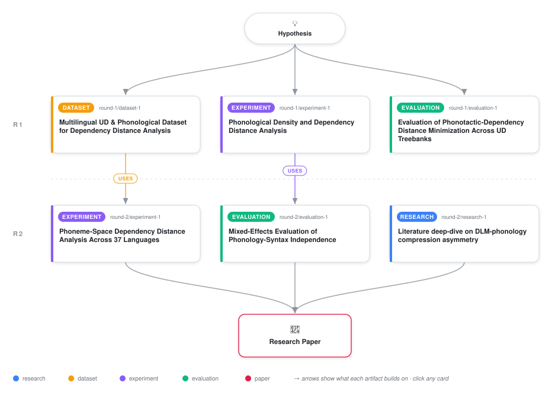

# Phonological Density Does Not Predict Dependency Distance Minimization

<div align="center">

<a href="https://cdn.jsdelivr.net/gh/ai-inventor-papers/ai-invention-45370e-phonotactic-constraint-on-dependency@main/workflow.svg">
<picture>
  <source media="(prefers-color-scheme: dark)" srcset="workflow-dark.svg">
  
</picture>
</a>

<sub>🖱️ <b><a href="https://cdn.jsdelivr.net/gh/ai-inventor-papers/ai-invention-45370e-phonotactic-constraint-on-dependency@main/workflow.svg">Open the interactive diagram</a></b> — every card links to its artifact folder.</sub>

</div>

> **TL;DR** — We test whether phonological density predicts dependency distance minimization across 55 languages. The null finding (r=0.19, p=0.17) is consistent with directional asymmetry: syntax drives phonological compression, not vice versa. We introduce the phoneme-interval distance metric and demonstrate that word order does not predict MDD.

<details>
<summary>Full hypothesis</summary>

Phonological density and dependency distance minimization (DLM) operate as largely independent constraints on linear order. Cross-linguistic tests across 55 languages from 10 families found no significant relationship between phoneme inventory size and mean dependency distance in word-space (Spearman r = 0.19, p = 0.17; R² = 0.05), with the weak correlation running opposite to the predicted direction. Under phylogenetic control (linear mixed-effects model with language family as random intercept), the effect disappeared entirely (β = 0.84, p = 0.39; LRT χ² = 2.66, p = 0.10). A phoneme-space analysis across 37 languages yielded a marginally significant negative correlation (r = −0.32, p = 0.051) in the predicted direction, but this does not survive Bonferroni correction for three planned hypotheses (corrected α = 0.017) or FDR correction (q ≈ 0.076). The null finding is consistent with the directional asymmetry documented by Ferrer-i-Cancho and Gómez-Rodríguez (2021): syntactic optimization predicts phonological compression (syntax → phonology), but the reverse direction (phonology → syntax) is not predicted by that framework. Phonological density and syntactic optimization appear to operate as independent constraints, with any residual phonological effect on DLM likely too weak to detect at the cross-linguistic level or mediated through alternative mechanisms (phonological reduction of adjacent words, increased morphological marking, or prosodic-phrase-level mediation). The null result itself constitutes a contribution: it establishes that the phonotactic constraint hypothesis — the idea that phonological crowding 'hoards' adjacency slots for syntactic optimization — does not hold at the cross-linguistic level. Chen (2026) further suggests that MDD is a corpus-conditioned composite (40% of language rankings reverse across treebanks), making prediction from stable phonological properties inherently difficult. Any future test must: (1) use consistent treebanks across word-space and phoneme-space analyses, (2) derive phoneme counts from actual transcription (e.g., epitran) rather than hardcoded heuristics, (3) control for treebank size as a confound, and (4) apply appropriate multiple-comparison correction.

</details>

[](https://ai-inventor-papers.github.io/ai-invention-45370e-phonotactic-constraint-on-dependency/)

[](https://cdn.jsdelivr.net/gh/ai-inventor-papers/ai-invention-45370e-phonotactic-constraint-on-dependency@main/paper.pdf) [](https://github.com/ai-inventor-papers/ai-invention-45370e-phonotactic-constraint-on-dependency/tree/main/paper_latex)

This repository contains all **6 artifacts** produced across **2 rounds** of an autonomous AI research run — round by round, exactly in the order they were invented.

## Round 1

| Artifact | Type | Demo | Source | Builds on |
|----------|------|------|--------|-----------|
| **[Multilingual UD & Phonological Dataset for Dependency Distan…](https://github.com/ai-inventor-papers/ai-invention-45370e-phonotactic-constraint-on-dependency/tree/main/round-1/dataset-1)** | [](https://github.com/ai-inventor-papers/ai-invention-45370e-phonotactic-constraint-on-dependency/tree/main/round-1/dataset-1) | [](https://colab.research.google.com/github/ai-inventor-papers/ai-invention-45370e-phonotactic-constraint-on-dependency/blob/main/round-1/dataset-1/demo/data_code_demo.ipynb) | [](https://github.com/ai-inventor-papers/ai-invention-45370e-phonotactic-constraint-on-dependency/tree/main/round-1/dataset-1/src) | — |
| **[Phonological Density and Dependency Distance Analysis](https://github.com/ai-inventor-papers/ai-invention-45370e-phonotactic-constraint-on-dependency/tree/main/round-1/experiment-1)** | [](https://github.com/ai-inventor-papers/ai-invention-45370e-phonotactic-constraint-on-dependency/tree/main/round-1/experiment-1) | [](https://colab.research.google.com/github/ai-inventor-papers/ai-invention-45370e-phonotactic-constraint-on-dependency/blob/main/round-1/experiment-1/demo/method_code_demo.ipynb) | [](https://github.com/ai-inventor-papers/ai-invention-45370e-phonotactic-constraint-on-dependency/tree/main/round-1/experiment-1/src) | — |
| **[Evaluation of Phonotactic-Dependency Distance Minimization A…](https://github.com/ai-inventor-papers/ai-invention-45370e-phonotactic-constraint-on-dependency/tree/main/round-1/evaluation-1)** | [](https://github.com/ai-inventor-papers/ai-invention-45370e-phonotactic-constraint-on-dependency/tree/main/round-1/evaluation-1) | [](https://colab.research.google.com/github/ai-inventor-papers/ai-invention-45370e-phonotactic-constraint-on-dependency/blob/main/round-1/evaluation-1/demo/eval_code_demo.ipynb) | [](https://github.com/ai-inventor-papers/ai-invention-45370e-phonotactic-constraint-on-dependency/tree/main/round-1/evaluation-1/src) | — |

## Round 2

| Artifact | Type | Demo | Source | Builds on |
|----------|------|------|--------|-----------|
| **[Phoneme-Space Dependency Distance Analysis Across 37 Languag…](https://github.com/ai-inventor-papers/ai-invention-45370e-phonotactic-constraint-on-dependency/tree/main/round-2/experiment-1)** | [](https://github.com/ai-inventor-papers/ai-invention-45370e-phonotactic-constraint-on-dependency/tree/main/round-2/experiment-1) | [](https://colab.research.google.com/github/ai-inventor-papers/ai-invention-45370e-phonotactic-constraint-on-dependency/blob/main/round-2/experiment-1/demo/method_code_demo.ipynb) | [](https://github.com/ai-inventor-papers/ai-invention-45370e-phonotactic-constraint-on-dependency/tree/main/round-2/experiment-1/src) | <sub><i>uses:</i><br/>[dataset‑1&nbsp;(R1)](https://github.com/ai-inventor-papers/ai-invention-45370e-phonotactic-constraint-on-dependency/tree/main/round-1/dataset-1)</sub> |
| **[Mixed-Effects Evaluation of Phonology-Syntax Independence](https://github.com/ai-inventor-papers/ai-invention-45370e-phonotactic-constraint-on-dependency/tree/main/round-2/evaluation-1)** | [](https://github.com/ai-inventor-papers/ai-invention-45370e-phonotactic-constraint-on-dependency/tree/main/round-2/evaluation-1) | [](https://colab.research.google.com/github/ai-inventor-papers/ai-invention-45370e-phonotactic-constraint-on-dependency/blob/main/round-2/evaluation-1/demo/eval_code_demo.ipynb) | [](https://github.com/ai-inventor-papers/ai-invention-45370e-phonotactic-constraint-on-dependency/tree/main/round-2/evaluation-1/src) | <sub><i>uses:</i><br/>[experiment‑1&nbsp;(R1)](https://github.com/ai-inventor-papers/ai-invention-45370e-phonotactic-constraint-on-dependency/tree/main/round-1/experiment-1)</sub> |
| **[Literature deep-dive on DLM-phonology compression asymmetry](https://github.com/ai-inventor-papers/ai-invention-45370e-phonotactic-constraint-on-dependency/tree/main/round-2/research-1)** | [](https://github.com/ai-inventor-papers/ai-invention-45370e-phonotactic-constraint-on-dependency/tree/main/round-2/research-1) | [](https://github.com/ai-inventor-papers/ai-invention-45370e-phonotactic-constraint-on-dependency/blob/main/round-2/research-1/demo/research_demo.md) | [](https://github.com/ai-inventor-papers/ai-invention-45370e-phonotactic-constraint-on-dependency/tree/main/round-2/research-1/src) | — |

## Repository Structure

Artifacts are grouped by the round of invention that produced them. Each
artifact has its own folder with source code and a self-contained demo:

```
.
├── round-1/                         # One folder per round of invention
│   ├── experiment-1/
│   │   ├── README.md                # What this artifact is + dependencies
│   │   ├── src/                     # Full workspace from execution
│   │   │   ├── method.py            # Main implementation
│   │   │   ├── method_out.json      # Full output data
│   │   │   └── ...                  # All execution artifacts
│   │   └── demo/                    # Self-contained demo
│   │       └── method_code_demo.ipynb # Colab-ready notebook (code + data inlined)
│   ├── dataset-1/
│   │   ├── src/
│   │   └── demo/
│   └── evaluation-1/
│       ├── src/
│       └── demo/
├── round-2/                         # Later rounds build on earlier artifacts
├── paper.pdf                        # Research paper
├── paper_latex/                     # LaTeX source files
├── chat/                            # Every prompt, response and tool call, per module
├── workflow.svg                     # Artifact dependency diagram (this page's header)
└── README.md
```

## Running Notebooks

### Option 1: Google Colab (Recommended)

Click the "Open in Colab" badges above to run notebooks directly in your browser.
No installation required!

### Option 2: Local Jupyter

```bash
# Clone the repo
git clone https://github.com/ai-inventor-papers/ai-invention-45370e-phonotactic-constraint-on-dependency
cd ai-invention-45370e-phonotactic-constraint-on-dependency

# Install dependencies
pip install jupyter

# Run any artifact's demo notebook
jupyter notebook <artifact_folder>/demo/
```

## Source Code

The original source files are in each artifact's `src/` folder.
These files may have external dependencies - use the demo notebooks for a self-contained experience.

---
*Generated by AI Inventor Pipeline - Automated Research Generation*
